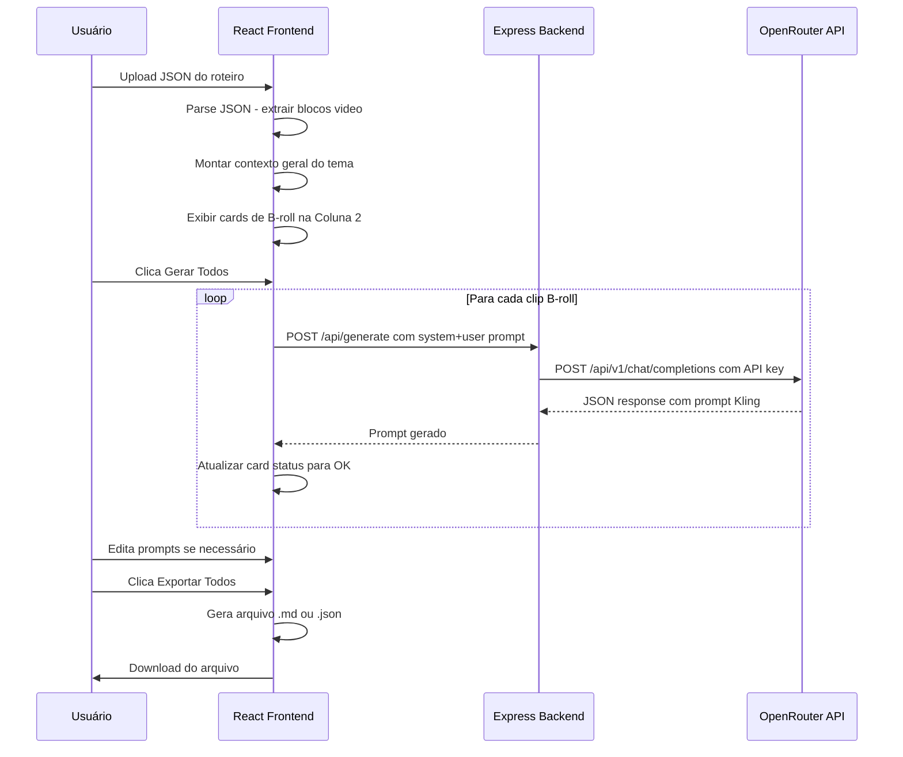

# Kling Prompter — Plano de Implementação

## Visão Geral

O **Kling Prompter** é um app local (web) que:
1. Recebe o JSON de roteiros de videoaulas PAM.ON
2. Extrai blocos de vídeo B-roll automaticamente
3. Gera prompts otimizados para Kling AI 3.0 via LLM (OpenRouter)
4. Permite edição, regeneração e exportação dos prompts

---

## Arquitetura do Sistema

```mermaid
graph TD
    subgraph Browser
        UI[React SPA - Vite]
        LS[localStorage - configs]
    end

    subgraph Express Server - localhost:3456
        API[Express API Routes]
        PROXY[OpenRouter Proxy]
    end

    subgraph External
        OR[OpenRouter API]
        MODELS[/api/v1/models]
        CHAT[/api/v1/chat/completions]
    end

    UI -->|POST /api/generate| API
    UI -->|GET /api/models| API
    UI -->|POST /api/validate-key| API
    API --> PROXY
    PROXY -->|API Key injected server-side| OR
    OR --> MODELS
    OR --> CHAT
    UI --> LS
```

### Fluxo de Dados Principal



---

## Fases de Implementação

### Fase 0 — Pré-requisitos e Documentação
- Criar `OPENROUTER_DOCS_INDEX.md` com referência completa da API OpenRouter
- Conteúdo: endpoints, parâmetros de request, provider routing, plugins, modelos, erros, rate limits

### Fase 1 — Scaffolding do Projeto
- Inicializar `app/` com `package.json`, dependências, TypeScript config, Vite config
- Configurar Tailwind CSS com dark mode como default
- Criar `index.html` base
- Configurar `npm run dev` para iniciar Express + Vite concorrentemente

### Fase 2 — Backend Express
- `server/index.ts` — Express server na porta 3456 com rotas:
  - `GET /api/models` — proxy para OpenRouter `/api/v1/models`
  - `POST /api/generate` — proxy para OpenRouter `/api/v1/chat/completions`
  - `POST /api/validate-key` — testa key com GET a `/api/v1/models`
- `server/openrouter.ts` — wrapper com:
  - Injeção de API key (do body do request, nunca hardcoded no servidor)
  - Timeout de 60 segundos
  - Tratamento de erros com mensagens em PT-BR
  - Suporte a todos os parâmetros OpenRouter

### Fase 3 — Lógica de Negócio (src/lib/)
- `systemPrompt.ts` — System prompt completo extraído da especificação (5-layer formula, anti-padrões, biases, negative prompt rules, camera vocabulary, PAM.ON context)
- `promptTemplate.ts` — Função `buildUserPrompt()` que monta o prompt do usuário com tema, contexto, clip data
- `jsonParser.ts` — Parser do JSON PAM.ON que:
  - Extrai `title` como nome do tema
  - Classifica blocos por `type`: section, presenter, video, slide, note
  - Para cada bloco `video`: extrai narração, encontra nota `🎬` subsequente, identifica seção pai, contexto adjacente
  - Monta contexto geral concatenando presenter + slide
  - Retorna tipagem TypeScript forte

### Fase 4 — Componentes React (UI)
Ordem de implementação baseada em dependências:

1. **App.tsx** — Layout 3 colunas com header/footer
2. **ApiKeyManager.tsx** — Modal de gerenciamento de API key (hardcoded default + override + validação)
3. **JsonUploader.tsx** — Drag-and-drop + parsing do JSON
4. **ThemeContext.tsx** — Exibe título + resumo colapsável do tema
5. **VideoBlockList.tsx** — Cards de B-roll com status, edição, seleção, reordenação
6. **ModelSelector.tsx** — Dropdown searchable com modelos do OpenRouter (live fetch)
7. **ConfigPanel.tsx** — Todos os parâmetros de sampling, provider routing, plugins, formato de resposta, sufixos
8. **PromptGenerator.tsx** — Lógica de geração: monta chamada, envia, parseia resposta
9. **PromptEditor.tsx** — Prompt editável + negative prompt + configs recomendadas + score + notas
10. **PromptExporter.tsx** — Exportação como .md e .json

### Fase 5 — Integração e Testes
- Conectar todos os componentes
- Testar com JSON do roteiro "Distância de Seguimento"
- Validar: 4 blocos B-roll identificados, prompts 80-150 palavras, câmera na 1ª frase, inglês, 5 camadas
- Validar todos os 20+ itens do checklist de entrega

---

## Estrutura de Pastas Final

```
app/
├── package.json
├── tsconfig.json
├── tsconfig.node.json
├── vite.config.ts
├── tailwind.config.ts
├── postcss.config.js
├── index.html
├── server/
│   ├── index.ts          # Express server - porta 3456
│   └── openrouter.ts     # Wrapper da API OpenRouter
├── src/
│   ├── main.tsx          # Entry point React
│   ├── App.tsx           # Layout principal 3 colunas
│   ├── vite-env.d.ts     # Type declarations Vite
│   ├── components/
│   │   ├── JsonUploader.tsx
│   │   ├── ThemeContext.tsx
│   │   ├── VideoBlockList.tsx
│   │   ├── PromptGenerator.tsx
│   │   ├── PromptEditor.tsx
│   │   ├── PromptExporter.tsx
│   │   ├── ModelSelector.tsx
│   │   ├── ConfigPanel.tsx
│   │   └── ApiKeyManager.tsx
│   ├── lib/
│   │   ├── systemPrompt.ts    # System prompt completo
│   │   ├── promptTemplate.ts  # Template do user prompt
│   │   ├── jsonParser.ts      # Parser JSON PAM.ON
│   │   └── types.ts           # TypeScript interfaces
│   └── styles/
│       └── globals.css        # Tailwind base + dark mode
└── public/
```

---

## Dependências do Projeto

```json
{
  "dependencies": {
    "react": "^18.3",
    "react-dom": "^18.3",
    "express": "^4.18",
    "cors": "^2.8"
  },
  "devDependencies": {
    "@types/react": "^18.3",
    "@types/react-dom": "^18.3",
    "@types/express": "^4.17",
    "@types/cors": "^2.8",
    "@vitejs/plugin-react": "^4.3",
    "typescript": "^5.5",
    "vite": "^5.4",
    "tailwindcss": "^3.4",
    "postcss": "^8.4",
    "autoprefixer": "^10.4",
    "tsx": "^4.19",
    "concurrently": "^8.2"
  }
}
```

**Dev command:** `concurrently "tsx watch server/index.ts" "vite"`

---

## Tipos TypeScript Principais

```typescript
// Bloco do roteiro PAM.ON
interface ScriptBlock {
  type: 'section' | 'presenter' | 'video' | 'slide' | 'note';
  narrationHtml?: string;
  text?: string;
  // ... outros campos do JSON
}

// Clipe B-roll extraído
interface BRollClip {
  id: string;
  clipNumber: number;
  sectionName: string;
  narration: string;          // narrationHtml limpo
  visualReference: string;    // nota 🎬 correspondente
  adjacentContext: string;    // presenter antes + depois
  status: 'pending' | 'generating' | 'done' | 'error';
  generatedPrompt?: GeneratedPrompt;
}

// Prompt gerado pela IA
interface GeneratedPrompt {
  prompt: string;
  negative_prompt: string;
  camera_movement: string;
  duration_recommendation: string;
  resolution_recommendation: string;
  audio_recommendation: string;
  confidence_score: number;
  notes: string;
}

// Configuração do OpenRouter
interface OpenRouterConfig {
  model: string;
  temperature: number;
  top_p: number;
  top_k: number;
  frequency_penalty: number;
  presence_penalty: number;
  repetition_penalty: number;
  min_p: number;
  top_a: number;
  seed?: number;
  max_tokens: number;
  stop?: string[];
  verbosity?: string;
  provider?: ProviderConfig;
  plugins?: PluginConfig;
  response_format?: { type: string };
}
```

---

## Rotas do Express Backend

| Método | Rota | Descrição | Request Body | Response |
|--------|------|-----------|-------------|----------|
| GET | `/api/models` | Lista modelos OpenRouter | — | `{ data: Model[] }` |
| POST | `/api/generate` | Gera prompt via LLM | `{ apiKey, model, messages, ...params }` | `{ choices: [...] }` |
| POST | `/api/validate-key` | Valida API key | `{ apiKey }` | `{ valid: boolean, error?: string }` |

**Nota:** A API key é enviada no body do request frontend→backend. O backend a injeta no header `Authorization: Bearer <key>` da chamada ao OpenRouter. A key NUNCA é hardcoded no servidor — apenas no frontend (localStorage).

---

## Decisões de Design Importantes

### 1. Geração Sequencial, não Paralela
"Gerar Todos" processa clips um a um para:
- Evitar rate limiting do OpenRouter
- Permitir progress tracking visual por card
- Simplificar error handling

### 2. API Key no Frontend, Proxy no Backend
- Key default hardcoded no código frontend + salva em localStorage
- Frontend envia key no body de cada request ao Express
- Express injeta no header Authorization e faz proxy para OpenRouter
- Resultado: key nunca aparece em URLs ou logs do browser network tab de forma exposta

### 3. JSON Response Format Enforced
- `response_format: { type: "json_object" }` habilitado por padrão
- Plugin `response-healing` recomendado ON como fallback
- Se JSON vier malformado: tentar `JSON.parse()` → se falhar, tentar extrair JSON de markdown code blocks → se falhar, mostrar erro

### 4. System Prompt como Constante
- O system prompt inteiro (~3000-4000 tokens) é uma string constante em `systemPrompt.ts`
- Contém toda a knowledge base da deep research
- Nunca é editado pelo usuário — é o "cérebro" fixo do app

### 5. Dark Mode por Padrão
- Tailwind configurado com `darkMode: 'class'`
- Classe `dark` aplicada no `<html>` por padrão
- Paleta: fundo #0f172a (slate-900), cards #1e293b (slate-800), texto #f1f5f9 (slate-100)

---

## Layout da Interface

```
┌─────────────────────────────────────────────────────────────────────────┐
│  HEADER: Kling Prompter — PAM.ON       [⚙ Config] [🔑 API Key]       │
├──────────────────┬──────────────────────┬───────────────────────────────┤
│                  │                      │                               │
│  COLUNA 1        │  COLUNA 2            │  COLUNA 3                     │
│  w-1/4           │  w-1/3               │  w-5/12                       │
│                  │                      │                               │
│  JsonUploader    │  VideoBlockList      │  PromptEditor                 │
│  ThemeContext    │  cards de B-roll     │  PromptExporter               │
│                  │  + Gerar Todos btn   │                               │
│                  │                      │                               │
├──────────────────┴──────────────────────┴───────────────────────────────┤
│  FOOTER: Status API | Modelo selecionado | Créditos estimados           │
└─────────────────────────────────────────────────────────────────────────┘
```

As 3 colunas usam flexbox com proporções ~25% / ~33% / ~42% para dar mais espaço ao editor de prompts. Em telas < 1024px, empilham verticalmente.

---

## Estratégia de Exportação

### Formato .md
```markdown
# Prompts Kling AI — [Título do Tema]
Gerado em: [data/hora ISO]
Modelo utilizado: [model ID]

---

## B-roll #1 — [Seção]

**Prompt:**
[prompt 80-150 palavras em inglês]

**Negative Prompt:**
[5-10 keywords]

**Configuração recomendada:**
- Resolução: 720p (teste) / 1080p (final)
- Duração: 5s
- Áudio nativo: OFF
- Aspect ratio: 16:9

**Score de confiança:** 8/10
**Notas:** [notas da IA]
```

### Formato .json
Array de objetos `GeneratedPrompt` com metadata adicional (clipNumber, sectionName, generatedAt).

---

## Checklist de Entrega (20+ itens)

- [ ] `npm install` roda sem erros
- [ ] `npm run dev` inicia o app acessível em localhost
- [ ] Upload de JSON funciona
- [ ] Parser identifica corretamente os 4 blocos de vídeo do roteiro de exemplo
- [ ] Contexto geral do tema é exibido corretamente
- [ ] Seletor de modelos carrega lista do OpenRouter
- [ ] API key padrão funciona
- [ ] Botão de alterar API key funciona
- [ ] Gerar Prompt para 1 clipe funciona e retorna JSON válido
- [ ] Gerar Todos funciona sequencialmente
- [ ] Prompt gerado segue a fórmula de 5 camadas
- [ ] Prompt está em inglês, 80-150 palavras
- [ ] Negative prompt está presente e focado (5-10 termos)
- [ ] Edição manual do prompt funciona
- [ ] Copiar Prompt funciona
- [ ] Exportar Todos gera arquivo .md correto
- [ ] Todos os parâmetros do ConfigPanel estão presentes e funcionais
- [ ] Interface está em português brasileiro
- [ ] Dark mode está ativo por padrão
- [ ] Erros da API mostram mensagens claras

---

## Notas sobre Passo 0 — OPENROUTER_DOCS_INDEX.md

O documento de índice da API OpenRouter será criado com base no conhecimento completo da API, cobrindo:
- Endpoints: `/api/v1/chat/completions`, `/api/v1/models`, `/api/v1/generation`
- Todos os parâmetros de sampling (temperature, top_p, top_k, etc.)
- Provider routing completo (sort, order, fallbacks, quantizations, ZDR, etc.)
- Plugins disponíveis (web, file-parser, response-healing, context-compression)
- Model suffixes (:nitro, :floor, :free)
- Structured outputs e response_format
- Error codes e rate limits
- Autenticação via Bearer token
